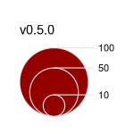
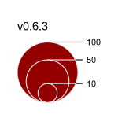

`maplegend` is a package for creating legends for maps and other graphics.  

This release introduces several changes. The main ones are the improvement of 
the proportionnal symbols display and the addition of four new legend types:

- choropleth legend on circles or squares
- choropleth legend on lines
- choropleth legend on symbols
- typology legend on lines.

Other changes are bug fixes and minor improvements.

```{r}
#| include: false
library(knitr)
knit_hooks$set(par = function(before, options, envir) {
  if (before && options$fig.show != "none") par(mar = c(1, 1, 2, 1))
})
```

## Proportionnal symbols

```{r}
#| code-fold: true
#| eval: false
#| code-summary: "Code for the figure"
png("legend.png", width = 150, height = 150, res = 110)
library(maplegend)
par(mar = c(1,1,1,1))
plot(0, ann = FALSE, axes = FALSE, pch = NA)
leg(type = "prop", val = c(10, 50, 100), inches = .35, pos = "top", 
    title = "v0.6.3", col = "#940000", border = "grey90", fg = "black", lwd = 1)
dev.off()
```
  


## New legend types

```{r new_types}
#| fig-width: 4.5
#| fig-height: 3.2
#| code-fold: true
#| code-summary: "Code for the figure"
#| par: true
library(maplegend)
plot(0, ann = FALSE, axes = FALSE, pch = NA)
# choropleth legends on circles or square
leg(type = "choro_point", val = seq(0, 100, 20), pos = "topleft", pal = 'Burg', 
    cex = 1, val_rnd = 0, symbol = "circle", title = "type = 'choro_point'")
leg(type = "choro_point", val = seq(0, 100, 20), pos = "topleft", pal = 'Burg', 
    cex = 1, val_rnd = 0, symbol = "square", title = "       ", adj = c(15, 0))
# choropleth legend on lines
leg(type = "choro_line", val = c(10, 20, 30, 40, 50), pos = "topright", 
    pal = 'Teal', lwd = 5, val_rnd = 0, no_data = TRUE, no_data_txt = "No data",
    title = "type = 'choro_line'")
# choropleth legend on symbols
leg(type = "choro_symb", val = c(10, 20, 30, 40, 50), pch = 24, pal = "Rocket", 
    pos = "bottomleft", cex = 2, val_rnd = 1, lwd = 1,  
    title = "type = 'choro_symb'")
# typology legend on lines
leg(type = "typo_line", val = c("A", "B", "C"), lwd = 4, pos = "bottomright", 
    pal = c("#da131a", "#ffb915", "#007847"), no_data = TRUE, col_na = "white",  
    frame = TRUE, bg = "#292421", fg = "white", frame_border = NA, 
    box_cex = c(2, 1), title = "type = 'typo_line'")
title("New legend types")
```

-------

**See the [NEWS file](https://cran.r-project.org/web/packages/maplegend/news/news.html) for the complete list of changes.**
