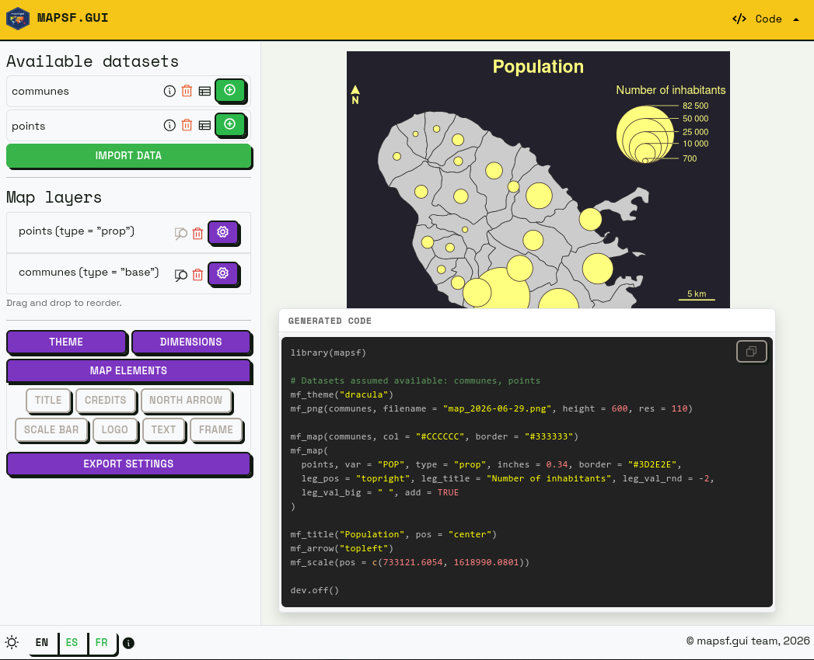
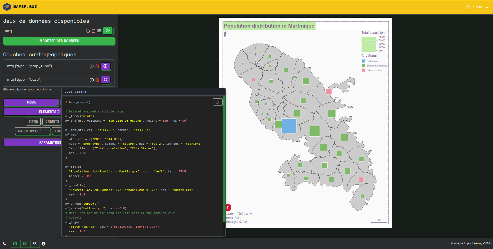
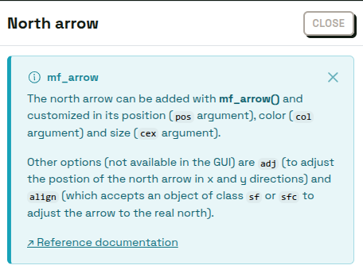
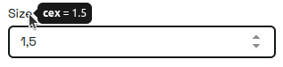
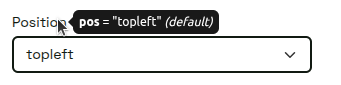
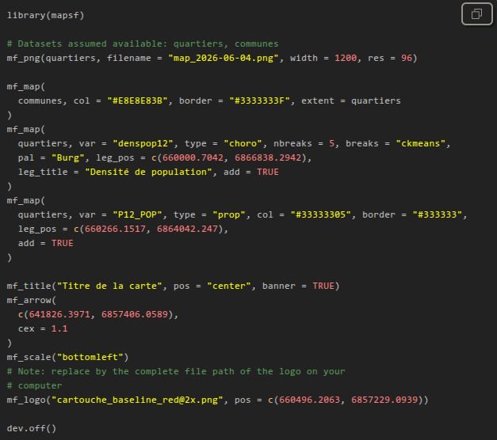

`mapsf.gui` is a `shiny` application that provides an interactive interface for creating thematic maps using the `mapsf` package. It automatically generates the corresponding R code to reproduce the map identically.  
`mapsf.gui` is useful for familiarizing yourself with `mapsf` and learning about its main features.




`mapsf.gui` was presented for the first time at the main French R-related event, *les Rencontres R*, in June 2026. See the [abstract](https://rr2026.sciencesconf.org/712364) and the [slides](RR2026_mapsf.gui.pdf) (in French). 


## Features

* Load and manage multiple spatial datasets.
* Select different types of thematic maps.
* Customize classification methods, color palettes etc.
* Manage various map elements such as legends, title, scale and north arrow.
* Discover the corresponding code in real-time as you construct maps.
* Copy the R code for reproducibility of the maps created.
* Download maps as images (PNG or SVG).


<iframe width="760" height="430" src="https://www.canal-u.tv/chaines/riate/embed/178629?t=0" allowfullscreen></iframe>


## An educational app

We chose to develop `mapsf.gui` for educational purposes. The application is designed to help users familiarise themselves with the production of thematic maps in R, by allowing them to visualise the effects of their parameter choices both on the final map and the generated code.

At a time when many people are turning to the code-generation capabilities offered by LLMs (which generally result in little control over the code produced, and thus a poor understanding of that code), we have chosen to take an opposite approach: offering users the ability to carry out the various steps involved in creating a thematic map with a few clicks, whilst allowing them to view, in real time, the code corresponding to the different actions performed within the interface.

To this end, we have chosen to include several features that enable the user to fully understand what they are doing.

The most important of these elements is probably the panel displaying the R code generated in real time. Because this panel can require a certain amount of screen space, it can be moved manually within the interface, so that the user can position it as they wish in the most convenient place to follow the changes being made to it in real time.



The second important feature is the presence of dedicated help blocks for each settings panel (theme, export dimensions, north arrow, etc.). These help blocks, which can be displayed optionally, clearly set out several key details: the name of the `mapsf` function used (for example, `mf_arrow`, `mf_title`, etc.), what the function does, and the main arguments it can take. A link to the official documentation page is also provided here.

{style="border: 1px solid #383838; border-radius: 4px;" alt="Help block for the mf_arrow function"}

The third important feature is more subtle and appears when you hover over the various options in the application: a tooltip displays the exact name of the argument used, its value and (where applicable) whether it is the argument’s default value (see below in the section on code generation).

{alt="Tooltip in the north arrow settings panel (cex = 1.5)"} {alt="Tooltip in the north arrow settings panel (pos = 'topleft', default value)"}

We believe that these various elements help to establish a cognitive link between the graphical parameters and the code statements used to generate them.
As such, the `mapsf.gui` interface is not designed to avoid code, but rather to serve as a springboard to help you get to grips with it!


## Towards code generation as close as possible to human-written code

We have taken care to ensure that the code generated is as close as possible to what a human would have written.

Firstly, the code is well-organized thanks to line breaks (for example, between library imports and the first `mapsf` instructions, between the steps specific to displaying map representations and those specific to displaying layout elements, etc.) and the addition of comments where necessary.

Secondly, we use idiomatic code formatting (the order of arguments for each function, line breaks when there are many arguments, maximum line length, etc.) to make the code easier to read and understand.

{alt="Code panel containing the code generated by the app"}

Finally, an important feature is the removal of arguments whose values are equal to their default values.

To do this, we check, for each argument, whether there is a default value in the signature of the corresponding function. But that’s not all: some arguments do not have a default value in the function signature, but rather a value defined in the current `mapsf` theme. We also check for this in order to remove these arguments. We made this choice because we believe this is how `mapsf` users tend to write code.

## Installation and quick start-up 

You can install the stable version of `mapsf.gui` from CRAN:
```r
install.packages('mapsf.gui')
```
Alternatively, you can install the development version of `mapsf.gui` from [r-universe](https://riatelab.r-universe.dev/mapsf.gui) with:
```r
install.packages("mapsf.gui", repos = c('https://riatelab.r-universe.dev', 'https://cloud.r-project.org'))
```

To get started quickly, you can use the bundled `mapsf` dataset with the following example: 

```r
com <- mapsf::mf_get_mtq('polygons')
pts <- mapsf::mf_get_mtq('points')
mapsf.gui::run_app(data = list(communes = com, points = pts))
```


## Limitations and alternatives

Please note that not all of `mapsf`'s features are available through the GUI. 
You can check out [`mapsf` documentation](https://riatelab.github.io/mapsf/) (as well as the various help panels in `mapsf.gui`) to learn more about this.

Moreover, `mapsf.gui` is not intended to replace dedicated thematic cartography software. If you’re not interested in learning R / `mapsf` code or in reproducibility, we also develop [Magrit](https://magrit.cnrs.fr): a Web-based thematic cartography app that offers a comprehensive experience for learning or teaching cartography itself.
