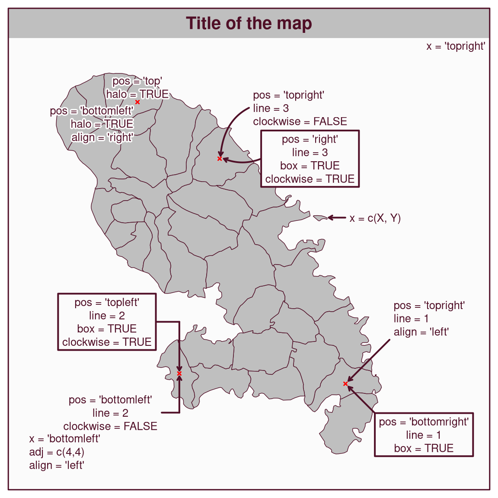
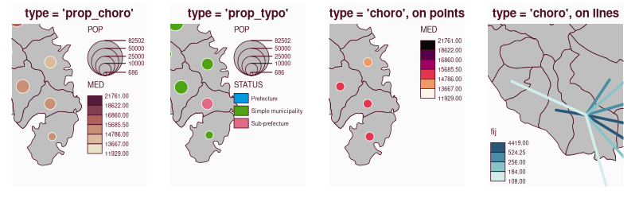
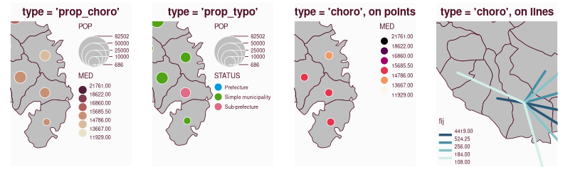

`mapsf` is a thematic cartography package for R that helps to design different kinds of maps, such as proportional symbols, choropleths, or typology maps. 

This post shows some of the new features introduced by the last release of the package:

- [A new function to add a logo on a map](#mf_logo)
- [A new function to add a text on a map](#mf_text)
- [New arguments in `mf_map()` to use an extent and a background color](#mf_map)
- [Improved legends for various map types](#leg)
- [Display of class boundaries in the statistical distribution plot](#mf_distr)
- [More fine-grained documentation for `mf_map()`](#doc)
- [Deprecated functions and arguments](#deprec)


The dataset used in this post is about apartment rental prices in 2023 in Paris and the surrounding municipalities (<small>[source](https://www.data.gouv.fr/fr/datasets/carte-des-loyers-indicateurs-de-loyers-dannonce-par-commune-en-2023/#/resources/43618998-3b37-4a69-bb25-f321f1a93ed1)</small>).  
<small>Download the dataset:</small> [](com.gpkg)


## A new function to add a logo on a map {#mf_logo}

`mf_logo()` can be used to display an image on a map. It supports PNG and JPG/JPEG file formats. 

```{r}
#| fig-width: 4.5
#| fig-height: 4
library(mapsf)
com <- sf::st_read("com.gpkg", quiet = TRUE)
mf_map(com)
mf_scale()
filepath <- "Rlogo.png"
mf_logo(filepath, pos = "bottomleft", adj = c(0, 4))
mf_credits()
mf_title("Paris and the surrounding municipalities")
```


## A new function to add a text on a map {#mf_text}

The following figure provides an overview of the various options available for displaying text on a map using the `mf_text()` function. The code for the figure can be found in the [documentation](https://riatelab.github.io/mapsf/reference/mf_text.html). 




`mf_text()` replaces the [now deprecated function](#deprec) `mf_annotation()`. `mf_label()` will probably use `mf_text()` internally in a future version of `mapsf`.

## New arguments in `mf_map()` to use an extent and a background color {#mf_map}

The `extent` argument allows a spatial object to be passed to `mf_map()` in order to define the map extent.
The `bg` argument allows a background color to be passed to the map.


```{r}
#| fig-width: 4
#| fig-height: 4
#| layout-ncol: 2
# define a target
target <- subset(com, NOM == "Vaucresson")
# define map background
mf_map(com, bg = "grey10")
mf_map(target, col = "red", add = TRUE)
mf_title(txt = "background color: 'grey10'")
# define map extent 
mf_map(com, extent = target, bg = "grey10")
mf_map(target, col = "red", add = TRUE)
mf_title(txt = "extent: target")
```

## Improved legends for various map types {#leg}

Benefiting from the [last update of `maplegend`](https://rcarto.github.io/posts/maplegend_v0.6.3/), various legends have been improved. These legends now more closely reflect what is displayed on the map in terms of symbols shapes and colors. 

  



```{r}
#| eval: false
#| code-fold: true
#| code-summary: "Code for the figures"
# install.packages("maplegend_0.5.0.tar.gz", repos = NULL, type = "source")
# install.packages("mapsf_1.1.0.tar.gz", repos = NULL, type = "source")
library(mapsf)
png("legend_old.png", width = 798, height = 249, res = 110)
par(mfrow = c(1,4))
mf_theme( mar = c(1,1,2,1))
m <- mf_get_mtq()
mf_map(m[17, ], expandBB = c(0,0,0,1))
mf_map(m, add = T)
mf_map(m, c("POP", "MED"), "prop_choro", inches = .2, leg_pos = "topright")
mf_title("type = 'prop_choro'")
mf_map(m[17,], expandBB = c(0,0,0,1.1))
mf_map(m, add = T)
mf_map(m, c("POP", "STATUS"), "prop_typo", inches = .2,leg_pos = "topright")
mf_title("type = 'prop_typo'")
mf_map(m[17,], expandBB = c(0,0,0,1))
mf_map(m, add = T)
mf_map(sf::st_centroid(m), "MED", "choro", leg_pos = "topright", pal = "Rocket", add = TRUE)
mf_title("type = 'choro', on points")
mob <- read.csv(system.file("csv/mob.csv", package = "mapsf"))
# Select links from Fort-de-France (97209))
mob_97209 <- mob[mob$i == 97209, ]
# Create a link layer
mob_links <- mf_get_links(x = m, df = mob_97209)
mf_map(expandBB = c(0,1,0,0), x = m[9, ])
mf_map(m, add = TRUE)
mf_map(mob_links, "fij", "choro", leg_pos = "bottomleft", pal = "Teal", add = TRUE, lwd = 3)
mf_title("type = 'choro', on lines")
dev.off()

# install.packages("mapsf")
library(mapsf)
png("legend_new.png", width = 798, height = 249, res = 110)
par(mfrow = c(1,4))
mf_theme( mar = c(1,1,2,1))
m <- mf_get_mtq()
mf_map(m, extent = m[17, ], expandBB = c(0,0,0,1))
mf_map(m, c("POP", "MED"), "prop_choro", inches = .2, leg_pos = "topright")
mf_title("type = 'prop_choro'")
mf_map(m, expandBB = c(0,0,0,1.1), extent = m[17, ])
mf_map(m, c("POP", "STATUS"), "prop_typo", inches = .2,leg_pos = "topright")
mf_title("type = 'prop_typo'")
mf_map(m, expandBB = c(0,0,0,1), extent = m[17, ])
mf_map(sf::st_centroid(m), "MED", "choro", leg_pos = "topright", pal = "Rocket", add = TRUE)
mf_title("type = 'choro', on points")
mob <- read.csv(system.file("csv/mob.csv", package = "mapsf"))
# Select links from Fort-de-France (97209))
mob_97209 <- mob[mob$i == 97209, ]
# Create a link layer
mob_links <- mf_get_links(x = m, df = mob_97209)
mf_map(m, expandBB = c(0,1,0,0), extent = m[9, ])
mf_map(mob_links, "fij", "choro", leg_pos = "bottomleft", pal = "Teal", add = TRUE, lwd = 3)
mf_title("type = 'choro', on lines")
dev.off()
```


## Display of class boundaries in the statistical distribution plot {#mf_distr}

`mf_distr()` displays the statistical distribution of a variable with a histogram, a box plot, a strip chart and a density curve on the same plot. This graphic can be useful for selecting an appropriate classification method for choropleth maps.  
With this release, user-defined class boundaries can also be displayed on the plot.
Some arguments have been added to allow changes to the title, y-label and y-axis. 

```{r}
#| fig-width: 8
#| fig-height: 3.5
mf_distr(com$loypredm2, main = "Appartment rental prices in 2023 (€/m²)", yaxt = FALSE)
# compute class intervals
bks <- mf_get_breaks(com$loypredm2, nbreaks = 5, breaks = "ckmeans")
# display class boundaries on the plot
mf_distr(com$loypredm2, main = "Appartment rental prices in 2023 (€/m²)", 
         yaxt = FALSE, pal = "Teal", breaks = bks)
```

## More fine-grained documentation for `mf_map()` {#doc}

The relevant arguments and default values differ for each map type. The documentation has been updated, with each map type now described in a dedicated help page. These pages provide relevant arguments and examples for points, lines, and polygon objects.  
See the help pages for [base maps](https://riatelab.github.io/mapsf/reference/mf_map_base.html), [choropleth maps](https://riatelab.github.io/mapsf/reference/mf_map_choro.html), [typology maps](https://riatelab.github.io/mapsf/reference/mf_map_typo.html) or [proportional symbols maps](https://riatelab.github.io/mapsf/reference/mf_map_prop.html) on the website.  
Alternatively, you can access this documentation directly from R with e.g. `?mf_map_base`, `?mf_map_choro`, `?mf_map_typo` or `?mf_map_prop`. 

## Deprecations {#deprec}

A new `?mapsf-deprecated` help page has been added in order to explicitly inform users about the deprecations going on in the package. 


The following functions and features are currently deprecated, they still work but they will be removed in the next [major version](https://semver.org/#summary) of the package.

* `mf_map` sub-functions (`mf_base()`, `mf_choro()`, `mf_prop()`...) are deprecated. Instead of using these functions, one must use `mf_map()` with the corresponding type.
* `mf_init()` is deprecated. It is possible to use `mf_map()` (`mf_map(x, type = "base", col = NA, border = NA)`) or the [`extent` argument](#mf_map) of `mf_map()` instead.
* `mf_export()` is deprecated, use `mf_png()` or `mf_svg()` instead.
* `mf_annotation` is deprecated, [use `mf_text()` instead](#mf_text).
* The use of separated legends for map types **prop_choro**, **prop_typo** and
**symb_choro** is deprecated. Use `leg_pos = NA` and `mf_legend()` if
separated legends are needed.
* In `mf_theme()`, the following themes are deprecated: "default", "brutal",
"ink", "dark", "agolalight", "candy", "darkula", "iceberg", "green",
"nevermind", "jsk" and "barcelona".  
The following arguments are also deprecated: "bg", "fg", "tab",
"pos", "inner", "line", "cex" and "font". See `?mf_theme()` for details.

-------

**See the [NEWS file](https://cloud.r-project.org/web/packages/mapsf/news/news.html) for the complete list of changes.**
