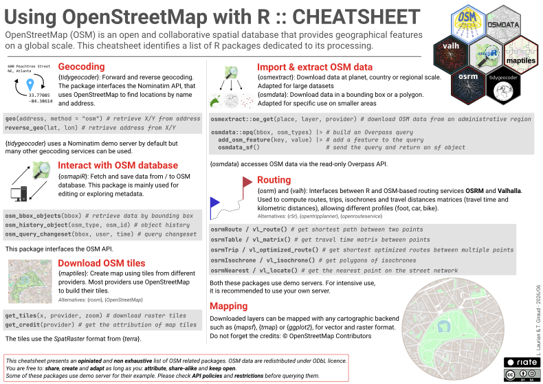
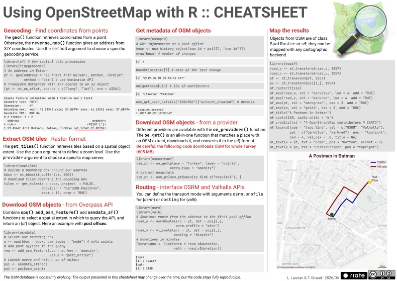

This [new cheat sheet](https://zenodo.org/records/20842874/files/cheatsheet_osm_r.pdf) guides users on how to use OpenStreetMap data and related tools with R for: geocoding, routing, downloading base maps and datasets.

